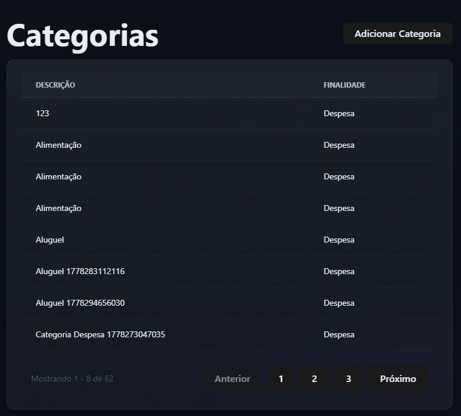

🐞 Bug Report — Sistema de Finanças
📌 Resumo

Durante testes da aplicação, foram identificados problemas de funcionalidade na interface de transações, inconsistências na exibição de dados e problemas visuais no gráfico de resumo financeiro.

🚨 Bugs encontrados
1. ❌ Edição e exclusão não disponíveis via UI
É possível criar categorias via interface
Porém não é possível editar ou excluir despesas via UI

📌 Impacto:
Limita a manutenção dos dados e obriga correções apenas via backend ou banco.

2. ❌ Permissão para duplicidade de despesas
O sistema permite criar duas ou mais despesas com o mesmo nome

📌 Impacto:
Pode gerar inconsistência e dificuldade de controle financeiro.

3. ❌ Dados ausentes na listagem de transações

Na aba de transações via UI:

A coluna "categoria" não exibe valores
A coluna "pessoa" não exibe valores

📌 Impacto:
Dificulta a análise e rastreabilidade das transações.

4. ❌ Problemas visuais no gráfico
O gráfico funciona funcionalmente
Porém visualmente apresenta problemas:
Informações ficam sobrepostas
Legenda e valores ficam ilegíveis

📌 Impacto:
Prejudica a usabilidade e interpretação dos dados.

5. ❌ Inconsistência após remoção de usuário
Mesmo após a exclusão de um usuário:
Algumas informações permanecem no gráfico
Quadrados/itens continuam visíveis abaixo do gráfico de pizza

📌 Impacto:
Indica possível problema de sincronização de estado entre UI e dados.

------------------------------------------- Bug Report estilo Jira -------------------------------------------------

## BUG REPORT

📌 Título

Não é possível editar ou excluir categorias via interface (UI)

🧾 Tipo de Issue

Bug

🚨 Criticidade

Alta

📍 Ambiente

Aplicação: Sistema de Finanças
Interface: Web (UI)
Módulo: Categorias
Plataforma: Frontend

🧩 Descrição

Foi identificado que, apesar de ser possível criar categorias normalmente via interface, não existe funcionalidade disponível para editar ou excluir diretamente pela UI.

Isso limita a gestão dos dados e impede correções ou ajustes sem acesso ao backend ou banco de dados.

🔁 Passos para reproduzir

Acessar o sistema "Minhas Finanças"
Navegar até a seção de Categorias
Criar uma nova categoria via interface
Tentar localizar opções de edição ou exclusão da categoria criada

❌ Resultado atual

Não existem botões ou ações de editar categoria
Não existem botões ou ações de excluir categoria
A categoria permanece fixa após criação

✅ Resultado esperado

Deve ser possível editar uma categoria já criada via UI
Deve ser possível excluir uma categoria via UI
A interface deve oferecer ações claras de manutenção dos dados

📊 Impacto

Dificulta a correção de erros de cadastro
Obriga intervenção direta no backend ou banco de dados
Reduz a praticidade de usabilidade do sistema
Impacta negativamente a experiência do usuário final

⚠️ Severidade

Alta

Motivo:

Afeta funcionalidade essencial do sistema (CRUD de categoria)
Compromete a integridade operacional da aplicação
Exige intervenção técnica externa para correções simples

💡 Observações adicionais

A funcionalidade de criação está funcionando corretamente
O problema parece estar restrito às ações de update e delete na UI
Pode indicar feature não implementada ou botão oculto/ausente no frontend

📎 Evidências

🚀 Sugestão de melhoria

Implementar ações de edição e exclusão na interface de despesas
Adicionar botões visíveis e acessíveis na listagem
Garantir consistência com padrão CRUD completo na UI